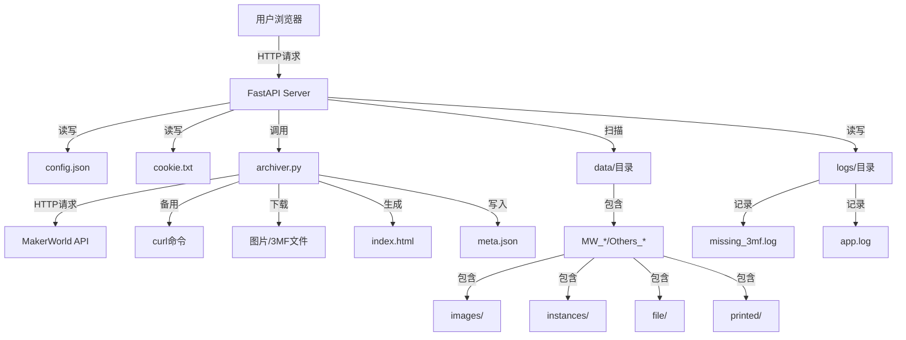
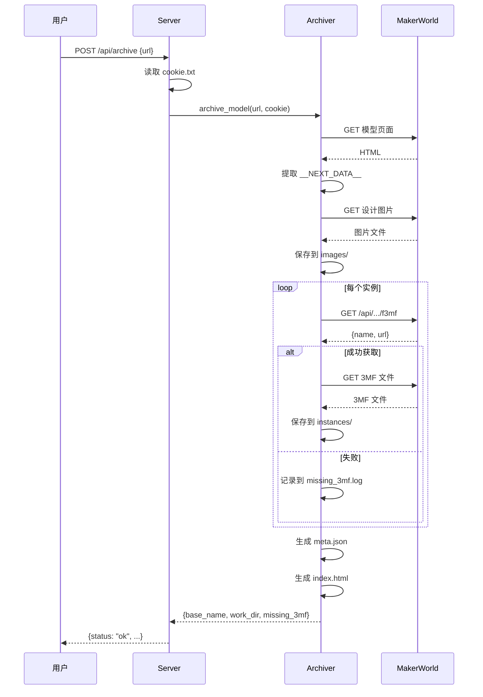
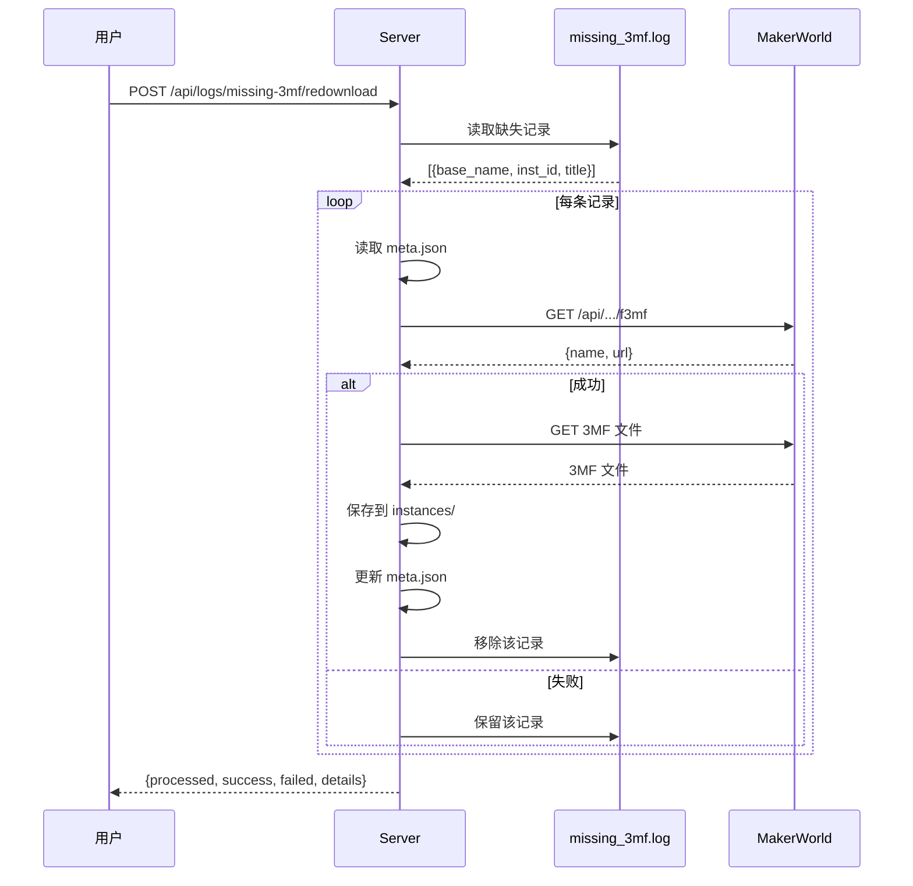
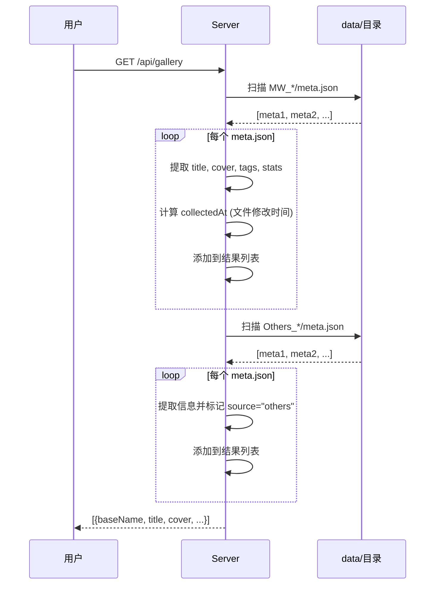

# MakerWorld 本地归档应用 - 架构与功能文档

> **项目概述**: 一键采集 MakerWorld 3D 模型，实现本地归档、浏览与复用的 Web 应用

---

## 📋 目录

- [核心功能](#核心功能)
- [技术架构](#技术架构)
- [数据流程](#数据流程)
- [API 接口](#api-接口)
- [存储结构](#存储结构)
- [优化建议](#优化建议)

---

## 核心功能

### 1. 模型采集与归档

**功能描述**: 从 MakerWorld 网站抓取 3D 模型的完整信息并本地化存储

**关键特性**:
- ✅ **一键采集**: 输入模型 URL 即可自动抓取所有相关数据
- ✅ **完整数据**: 包含元数据、图片、3MF 文件、实例配置等
- ✅ **离线浏览**: 生成独立的 HTML 页面,无需网络即可查看
- ✅ **Cookie 管理**: 支持在线配置 Cookie,处理需要登录的内容

**技术实现**:
- 使用 `requests` + `BeautifulSoup` 解析 HTML
- 提取 `__NEXT_DATA__` JSON 数据获取结构化信息
- 支持 `curl` 作为备用抓取方案(处理特殊编码/压缩)
- 自动下载所有关联资源(图片、3MF 文件等)

### 2. 3MF 文件管理

**功能描述**: 智能管理 3D 打印文件的下载与追踪

**关键特性**:
- ✅ **缺失追踪**: 自动记录下载失败的 3MF 文件到 `missing_3mf.log`
- ✅ **批量重试**: 支持一键重新下载所有缺失文件
- ✅ **实例级重下**: 针对单个实例 ID 重新获取下载地址
- ✅ **模型级重下**: 针对整个模型的所有实例批量重下
- ✅ **固定路径**: 实例文件固定命名为 `./instances/<实例标题>.3mf`,避免重复修改页面

**技术实现**:
- 调用 MakerWorld API 获取临时下载链接
- 支持自定义 `apiUrl` 参数,适配不同接口版本
- 下载成功后自动更新 `meta.json` 并清理缺失记录

### 3. 本地模型库

**功能描述**: 提供类似 MakerWorld 官网的本地浏览体验

**关键特性**:
- ✅ **卡片视图**: 展示模型封面、标题、作者、统计数据
- ✅ **搜索功能**: 支持按标题、标签、作者搜索
- ✅ **收藏/打印标记**: 支持标记收藏和已打印的模型
- ✅ **排序**: 支持按收藏时间、发布时间等排序
- ✅ **直接打开**: 点击卡片直接打开本地 HTML 页面

**技术实现**:
- 扫描 `data/` 目录下所有 `MW_*/meta.json` 文件
- 前端使用原生 JavaScript 实现搜索、筛选、排序
- 收藏/打印标记存储在 `gallery_flags.json`

### 4. 手动导入

**功能描述**: 支持导入非 MakerWorld 来源的模型

**关键特性**:
- ✅ **表单上传**: 支持上传封面、设计图、实例文件、附件等
- ✅ **灵活配置**: 可自定义标题、链接、摘要、标签
- ✅ **统一格式**: 生成与 MakerWorld 模型相同的目录结构和 HTML 页面
- ✅ **目录命名**: 使用 `Others_<标题>_<日期>` 格式命名

**技术实现**:
- FastAPI 的 `Form` 和 `File` 处理多部分表单数据
- 复用 `archiver.py` 的 HTML 生成逻辑
- 自动处理文件命名冲突(添加序号后缀)

### 5. 附件与打印照片管理

**功能描述**: 为每个模型添加额外的文件和打印成果照片

**关键特性**:
- ✅ **附件上传**: 支持上传任意文件到 `file/` 目录
- ✅ **打印照片**: 支持上传打印成果照片到 `printed/` 目录
- ✅ **在线展示**: 附件和照片在模型页面中展示
- ✅ **文件列表**: 提供 API 查询已上传的附件和照片

**技术实现**:
- 文件存储在模型目录的 `file/` 和 `printed/` 子目录
- 文件名自动清理非法字符,避免冲突
- 前端通过 API 动态加载文件列表

---

## 技术架构

### 系统架构图



### 技术栈

#### 后端
- **框架**: FastAPI 0.111.0
- **Web 服务器**: Uvicorn 0.30.3
- **HTTP 客户端**: Requests 2.32.3
- **HTML 解析**: BeautifulSoup4 4.12.3
- **备用工具**: curl (系统命令)

#### 前端
- **模板引擎**: Jinja2 (FastAPI 内置)
- **UI 框架**: 原生 HTML/CSS/JavaScript
- **样式**: 内联 CSS (在 `archiver.py` 中定义)

#### 部署
- **容器化**: Docker
- **基础镜像**: python:3.11-slim
- **端口**: 8000
- **挂载点**: `/app/data`, `/app/logs`, `/app/cookie.txt`

### 核心模块

#### 1. `archiver.py` (1777 行)

**职责**: 模型采集、文件下载、HTML 生成

**关键函数**:

| 函数名 | 功能 | 行数 |
|--------|------|------|
| `archive_model()` | 主入口,完成采集+下载+生成 | 1668-1771 |
| `fetch_html_with_curl()` | 使用 curl 备用抓取页面 | 79-119 |
| `extract_next_data()` | 提取 `__NEXT_DATA__` JSON | 122-126 |
| `fetch_instance_3mf()` | 获取 3MF 下载地址 | 235-293 |
| `build_index_html()` | 生成本地 HTML 页面 | 1070-1543 |
| `build_meta()` | 构建元数据 JSON | 339-391 |

**设计模式**:
- **函数式编程**: 大量纯函数,易于测试
- **容错设计**: 多层 try-except,支持 curl 兜底
- **数据驱动**: 基于 meta.json 重建页面

#### 2. `server.py` (1031 行)

**职责**: FastAPI 服务器,提供 REST API 和页面路由

**关键端点**:

| 端点 | 方法 | 功能 | 行数 |
|------|------|------|------|
| `/` | GET | 模型库页面 | 600-602 |
| `/config` | GET | 配置页面 | 605-607 |
| `/api/archive` | POST | 归档模型 | 632-656 |
| `/api/logs/missing-3mf` | GET | 获取缺失记录 | 659-661 |
| `/api/logs/missing-3mf/redownload` | POST | 批量重试 | 664-674 |
| `/api/instances/{id}/redownload` | POST | 实例重下 | 677-691 |
| `/api/models/{id}/redownload` | POST | 模型重下 | 694-708 |
| `/api/gallery` | GET | 模型列表 | 727-729 |
| `/api/manual-import` | POST | 手动导入 | 829-1010 |

**中间件**:
- **CORS**: 允许跨域请求
- **静态文件**: `/static` 和 `/files` 挂载

**日志系统**:
- 文件日志: `logs/app.log`
- 控制台日志: 实时输出
- Cookie 更新日志: `logs/cookie.log`

#### 3. 前端模板

**`gallery.html`** (6635 字节):
- 模型库卡片视图
- 搜索、筛选、排序功能
- 收藏/打印标记

**`config.html`** (10062 字节):
- Cookie 配置
- 模型归档表单
- 实时日志显示
- 缺失 3MF 列表与重试

---

## 数据流程

### 1. 模型归档流程



### 2. 缺失 3MF 重试流程



### 3. 模型库扫描流程



---

## API 接口

### 配置管理

#### `POST /api/cookie`
**功能**: 更新 Cookie

**请求体**:
```json
{
  "cookie": "cf_clearance=...; token=..."
}
```

**响应**:
```json
{
  "status": "ok",
  "updated_at": "2026-01-30T16:00:00"
}
```

#### `GET /api/config`
**功能**: 获取配置信息

**响应**:
```json
{
  "download_dir": "/app/data",
  "logs_dir": "/app/logs",
  "cookie_file": "/app/cookie.txt",
  "cookie_updated_at": "2026-01-30T16:00:00"
}
```

### 模型归档

#### `POST /api/archive`
**功能**: 归档 MakerWorld 模型

**请求体**:
```json
{
  "url": "https://makerworld.com.cn/zh/models/12345"
}
```

**响应**:
```json
{
  "status": "ok",
  "base_name": "MW_12345_模型名称",
  "work_dir": "/app/data/MW_12345_模型名称",
  "missing_3mf": ["实例1", "实例2"]
}
```

### 缺失文件管理

#### `GET /api/logs/missing-3mf`
**功能**: 获取缺失 3MF 记录

**响应**:
```json
[
  {
    "time": "2026-01-30T15:00:00",
    "base_name": "MW_12345_模型名称",
    "inst_id": "67890",
    "title": "实例标题",
    "status": "cookie失效"
  }
]
```

#### `POST /api/logs/missing-3mf/redownload`
**功能**: 批量重试缺失文件

**响应**:
```json
{
  "status": "ok",
  "processed": 10,
  "success": 8,
  "failed": 2,
  "details": [...]
}
```

#### `POST /api/instances/{inst_id}/redownload`
**功能**: 重新下载指定实例

**响应**:
```json
{
  "status": "ok",
  "found": 1,
  "success": 1,
  "failed": 0,
  "details": [...]
}
```

#### `POST /api/models/{model_id}/redownload`
**功能**: 重新下载模型的所有实例

**响应**:
```json
{
  "status": "ok",
  "processed": 5,
  "success": 5,
  "failed": 0,
  "details": [...]
}
```

### 模型库

#### `GET /api/gallery`
**功能**: 获取所有模型列表

**响应**:
```json
[
  {
    "baseName": "MW_12345_模型名称",
    "title": "模型标题",
    "id": 12345,
    "cover": "design_01.jpg",
    "dir": "MW_12345_模型名称",
    "source": "makerworld",
    "tags": ["标签1", "标签2"],
    "summary": "模型简介...",
    "author": {
      "name": "作者名",
      "url": "https://...",
      "avatarRelPath": "images/author_avatar.jpg"
    },
    "stats": {
      "likes": 100,
      "favorites": 50,
      "downloads": 200,
      "prints": 30,
      "views": 1000
    },
    "instanceCount": 3,
    "publishedAt": "2026-01-15T10:00:00",
    "collectedAt": "2026-01-30T15:00:00"
  }
]
```

#### `GET /api/gallery/flags`
**功能**: 获取收藏/打印标记

**响应**:
```json
{
  "favorites": ["MW_12345_模型1", "MW_67890_模型2"],
  "printed": ["MW_12345_模型1"]
}
```

#### `POST /api/gallery/flags`
**功能**: 保存收藏/打印标记

**请求体**:
```json
{
  "favorites": ["MW_12345_模型1"],
  "printed": ["MW_12345_模型1"]
}
```

### 附件管理

#### `GET /api/models/{model_dir}/attachments`
**功能**: 获取附件列表

**响应**:
```json
{
  "files": ["说明文档.pdf", "配置文件.json"]
}
```

#### `POST /api/models/{model_dir}/attachments`
**功能**: 上传附件

**请求**: `multipart/form-data` with `file`

**响应**:
```json
{
  "status": "ok",
  "file": "说明文档.pdf"
}
```

### 打印照片管理

#### `GET /api/models/{model_dir}/printed`
**功能**: 获取打印照片列表

**响应**:
```json
{
  "files": ["打印成果1.jpg", "打印成果2.jpg"]
}
```

#### `POST /api/models/{model_dir}/printed`
**功能**: 上传打印照片

**请求**: `multipart/form-data` with `file` (仅图片)

**响应**:
```json
{
  "status": "ok",
  "file": "打印成果1.jpg"
}
```

### 手动导入

#### `POST /api/manual-import`
**功能**: 手动导入模型

**请求**: `multipart/form-data` with:
- `title`: 标题 (必填)
- `modelLink`: 模型链接 (可选)
- `sourceLink`: 来源链接 (可选)
- `summary`: 摘要 (可选)
- `tags`: 标签,逗号分隔 (可选)
- `cover`: 封面图片 (可选)
- `design_images`: 设计图片数组 (可选)
- `instance_files`: 实例文件数组 (可选)
- `instance_pictures`: 实例图片数组 (可选)
- `attachments`: 附件数组 (可选)
- `instance_descs`: 实例描述 JSON 数组字符串 (可选)
- `instance_picture_counts`: 实例图片数量 JSON 数组字符串 (可选)

**响应**:
```json
{
  "status": "ok",
  "base_name": "Others_模型名称_20260130",
  "work_dir": "/app/data/Others_模型名称_20260130"
}
```

---

## 存储结构

### 目录布局

```
mw_archive/
├── app/                          # 主程序目录
│   ├── archiver.py               # 采集核心 (1777行)
│   ├── server.py                 # FastAPI 服务器 (1031行)
│   ├── config.json               # 配置文件
│   ├── cookie.txt                # Cookie 存储
│   ├── gallery_flags.json        # 收藏/打印标记
│   ├── requirements.txt          # Python 依赖
│   ├── templates/                # HTML 模板
│   │   ├── gallery.html          # 模型库页面
│   │   └── config.html           # 配置页面
│   ├── static/                   # 静态资源
│   │   ├── css/
│   │   ├── js/
│   │   └── imgs/
│   ├── data/                     # 归档数据 (建议挂载)
│   │   ├── MW_12345_模型名称/
│   │   │   ├── meta.json         # 元数据
│   │   │   ├── index.html        # 本地页面
│   │   │   ├── images/           # 图片资源
│   │   │   │   ├── design_01.jpg
│   │   │   │   ├── summary_img_01.jpg
│   │   │   │   └── author_avatar.jpg
│   │   │   ├── instances/        # 3MF 文件
│   │   │   │   ├── 实例1.3mf
│   │   │   │   └── 实例2.3mf
│   │   │   ├── file/             # 附件
│   │   │   │   └── 说明.pdf
│   │   │   └── printed/          # 打印照片
│   │   │       └── 成果1.jpg
│   │   └── Others_手动导入_20260130/
│   │       └── (同上结构)
│   └── logs/                     # 日志目录 (建议挂载)
│       ├── app.log               # 应用日志
│       ├── cookie.log            # Cookie 更新日志
│       └── missing_3mf.log       # 缺失 3MF 记录
├── others/                       # 历史资料
│   ├── tampermonkey/             # 旧油猴脚本
│   ├── mw_fetch/                 # 单文件采集脚本
│   └── index_only/               # 单页面导航
├── scripts/                      # 辅助脚本
│   ├── patch_attachments.py
│   └── patch_printed.py
├── Dockerfile                    # Docker 构建文件
├── docker_build.sh               # 构建脚本
└── README.md                     # 项目说明
```

### meta.json 结构

```json
{
  "baseName": "MW_12345_模型名称",
  "url": "https://makerworld.com.cn/zh/models/12345",
  "id": 12345,
  "slug": "model-slug",
  "title": "模型标题",
  "titleTranslated": "翻译标题",
  "coverUrl": "https://...",
  "tags": ["标签1", "标签2"],
  "tagsOriginal": ["Tag1", "Tag2"],
  "stats": {
    "likes": 100,
    "favorites": 50,
    "downloads": 200,
    "prints": 30,
    "views": 1000
  },
  "cover": {
    "url": "https://...",
    "localName": "design_01.jpg",
    "relPath": "images/design_01.jpg"
  },
  "author": {
    "name": "作者名",
    "url": "https://makerworld.com.cn/zh/@username",
    "avatarUrl": "https://...",
    "avatarLocal": "author_avatar.jpg",
    "avatarRelPath": "images/author_avatar.jpg"
  },
  "images": {
    "cover": "design_01.jpg",
    "design": ["design_01.jpg", "design_02.jpg"],
    "summary": ["summary_img_01.jpg"]
  },
  "designImages": [
    {
      "index": 1,
      "originalUrl": "https://...",
      "relPath": "images/design_01.jpg",
      "fileName": "design_01.jpg"
    }
  ],
  "summaryImages": [...],
  "summary": {
    "raw": "<p>原始 HTML</p>",
    "html": "<p>本地化 HTML</p>",
    "text": "纯文本摘要"
  },
  "instances": [
    {
      "id": 67890,
      "title": "实例标题",
      "name": "实例1.3mf",
      "downloadUrl": "https://...",
      "apiUrl": "https://makerworld.com.cn/api/v1/design-service/instance/67890/f3mf?type=download&fileType=",
      "publishTime": "2026-01-15T10:00:00",
      "extention": {
        "modelInfo": {
          "plates": [
            {
              "index": 1,
              "prediction": {...},
              "weight": 50.5,
              "filaments": [...],
              "thumbnailUrl": "https://...",
              "thumbnailRelPath": "images/MW_12345_inst67890_plate_01.jpg",
              "thumbnailFile": "MW_12345_inst67890_plate_01.jpg"
            }
          ],
          "auxiliaryPictures": [
            {
              "index": 1,
              "url": "https://...",
              "relPath": "images/MW_12345_inst67890_pic_01.jpg",
              "fileName": "MW_12345_inst67890_pic_01.jpg",
              "isRealLifePhoto": 1
            }
          ]
        }
      }
    }
  ],
  "generatedAt": "/absolute/path/to/work_dir",
  "note": "本文件包含结构化数据与打印配置详情。"
}
```

### missing_3mf.log 格式

每行一条记录,制表符分隔:

```
时间戳	base_name	inst_id	title	status
2026-01-30T15:00:00	MW_12345_模型名称	67890	实例标题	cookie失效
```

---

## 优化建议

### 🔴 高优先级

#### 1. 错误处理与日志优化

**问题**:
- `archiver.py` 中大量 `try-except` 块捕获 `Exception`,过于宽泛
- 日志信息不够详细,难以追踪问题根源
- 缺少请求重试机制,网络波动可能导致失败

**建议**:
```python
# 当前代码
try:
    data = r.json()
except Exception as e:
    log("JSON 解析失败:", e)
    return "", ""

# 优化后
import logging
from requests.exceptions import RequestException, Timeout

try:
    data = r.json()
except json.JSONDecodeError as e:
    logger.error(f"JSON 解析失败 [{inst_id}]: {e}, 响应内容: {r.text[:500]}")
    return "", ""
except RequestException as e:
    logger.error(f"网络请求失败 [{inst_id}]: {e}")
    return "", ""
```

**改进点**:
- 使用具体异常类型,避免捕获所有异常
- 添加更多上下文信息(实例 ID、响应内容等)
- 使用 `logging` 模块替代 `print`,支持日志级别

#### 2. 配置管理优化

**问题**:
- `config.json` 配置项较少,缺少超时、重试等参数
- Cookie 以明文存储,存在安全风险
- 缺少环境变量支持,不便于 Docker 部署

**建议**:
```python
# config.json 扩展
{
  "download_dir": "./data",
  "cookie_file": "./cookie.txt",
  "logs_dir": "./logs",
  "request_timeout": 30,
  "max_retries": 3,
  "concurrent_downloads": 5,
  "user_agent": "Mozilla/5.0 (MW-Archiver)"
}

# 支持环境变量
import os

def load_config():
    cfg = json.loads(CONFIG_PATH.read_text(encoding="utf-8"))
    # 环境变量优先级更高
    cfg["download_dir"] = os.getenv("MW_DOWNLOAD_DIR", cfg.get("download_dir", "./data"))
    cfg["cookie_file"] = os.getenv("MW_COOKIE_FILE", cfg.get("cookie_file", "./cookie.txt"))
    return cfg
```

**改进点**:
- 添加更多可配置参数
- 支持环境变量,方便 Docker 部署
- 考虑使用加密存储 Cookie (如 `cryptography` 库)

#### 3. 数据库支持

**问题**:
- 当前完全基于文件系统,模型数量增多后扫描性能下降
- 无法高效查询、筛选、统计
- 缺少数据完整性校验

**建议**:
```python
# 使用 SQLite 存储元数据索引
import sqlite3

# 数据库结构
CREATE TABLE models (
    id INTEGER PRIMARY KEY,
    base_name TEXT UNIQUE NOT NULL,
    title TEXT,
    source TEXT,  -- 'makerworld' or 'others'
    tags TEXT,    -- JSON 数组
    author_name TEXT,
    stats_likes INTEGER,
    stats_downloads INTEGER,
    instance_count INTEGER,
    published_at TEXT,
    collected_at TEXT,
    meta_path TEXT,
    INDEX idx_title ON models(title),
    INDEX idx_tags ON models(tags),
    INDEX idx_collected_at ON models(collected_at)
);

# 扫描时更新数据库
def sync_gallery_to_db(cfg):
    conn = sqlite3.connect(cfg["db_file"])
    for meta_path in Path(cfg["download_dir"]).glob("*/meta.json"):
        meta = json.loads(meta_path.read_text())
        conn.execute("""
            INSERT OR REPLACE INTO models (id, base_name, title, ...)
            VALUES (?, ?, ?, ...)
        """, (...))
    conn.commit()
```

**改进点**:
- 提升查询性能,支持复杂筛选
- 支持全文搜索(FTS5)
- 定期同步文件系统与数据库

### 🟡 中优先级

#### 4. 并发下载优化

**问题**:
- 当前串行下载图片和 3MF 文件,速度较慢
- 单个模型可能有数十张图片和多个实例

**建议**:
```python
import asyncio
import aiohttp
from concurrent.futures import ThreadPoolExecutor

async def download_file_async(session, url, dest):
    async with session.get(url) as resp:
        resp.raise_for_status()
        dest.parent.mkdir(parents=True, exist_ok=True)
        with open(dest, "wb") as f:
            async for chunk in resp.content.iter_chunked(8192):
                f.write(chunk)

async def download_all_images(images, session):
    tasks = [download_file_async(session, img["url"], img["dest"]) for img in images]
    await asyncio.gather(*tasks, return_exceptions=True)
```

**改进点**:
- 使用 `asyncio` + `aiohttp` 实现并发下载
- 可配置并发数,避免过载
- 添加进度条显示(如 `tqdm`)

#### 5. 前端优化

**问题**:
- 模型库页面加载所有模型,数量多时卡顿
- 缺少分页、虚拟滚动等优化
- 搜索功能在前端实现,大数据量下性能差

**建议**:
```javascript
// 分页加载
async function loadGallery(page = 1, pageSize = 20) {
    const resp = await fetch(`/api/gallery?page=${page}&page_size=${pageSize}`);
    const data = await resp.json();
    renderCards(data.items);
    renderPagination(data.total, page, pageSize);
}

// 后端支持分页
@app.get("/api/gallery")
async def api_gallery(page: int = 1, page_size: int = 20, search: str = ""):
    items = scan_gallery(CFG)
    # 搜索
    if search:
        items = [i for i in items if search.lower() in i["title"].lower()]
    # 分页
    total = len(items)
    start = (page - 1) * page_size
    end = start + page_size
    return {"items": items[start:end], "total": total, "page": page, "page_size": page_size}
```

**改进点**:
- 后端分页,减少数据传输
- 前端虚拟滚动(如 `react-window`)
- 搜索移到后端,支持模糊匹配

#### 6. 缓存机制

**问题**:
- 每次访问 `/api/gallery` 都重新扫描文件系统
- 模型数量多时扫描耗时较长

**建议**:
```python
from functools import lru_cache
from datetime import datetime, timedelta

# 缓存 5 分钟
_gallery_cache = {"data": None, "expires_at": None}

def scan_gallery_cached(cfg):
    now = datetime.now()
    if _gallery_cache["data"] and _gallery_cache["expires_at"] > now:
        return _gallery_cache["data"]
    
    data = scan_gallery(cfg)
    _gallery_cache["data"] = data
    _gallery_cache["expires_at"] = now + timedelta(minutes=5)
    return data

# 或使用 Redis
import redis
r = redis.Redis()

def scan_gallery_redis(cfg):
    cached = r.get("gallery_cache")
    if cached:
        return json.loads(cached)
    data = scan_gallery(cfg)
    r.setex("gallery_cache", 300, json.dumps(data))
    return data
```

**改进点**:
- 减少文件系统 I/O
- 支持手动刷新缓存
- 使用 Redis 支持分布式部署

### 🟢 低优先级

#### 7. 测试覆盖

**问题**:
- 缺少单元测试和集成测试
- 重构代码时容易引入 bug

**建议**:
```python
# tests/test_archiver.py
import pytest
from archiver import sanitize_filename, pick_ext_from_url

def test_sanitize_filename():
    assert sanitize_filename("模型:名称?") == "模型_名称_"
    assert sanitize_filename("normal_name") == "normal_name"

def test_pick_ext_from_url():
    assert pick_ext_from_url("https://example.com/image.jpg?v=1") == "jpg"
    assert pick_ext_from_url("https://example.com/file") == "jpg"  # fallback

# tests/test_server.py
from fastapi.testclient import TestClient
from server import app

client = TestClient(app)

def test_api_config():
    resp = client.get("/api/config")
    assert resp.status_code == 200
    assert "download_dir" in resp.json()
```

**改进点**:
- 使用 `pytest` 编写测试
- 覆盖核心函数和 API 端点
- 集成到 CI/CD 流程

#### 8. 文档生成

**问题**:
- API 文档需要手动维护
- 缺少交互式 API 文档

**建议**:
```python
# FastAPI 自动生成 OpenAPI 文档
# 访问 http://localhost:8000/docs 即可查看

# 添加更详细的描述
@app.post("/api/archive", summary="归档 MakerWorld 模型", description="...")
async def api_archive(body: dict):
    """
    归档指定 URL 的 MakerWorld 模型到本地。
    
    - **url**: 模型页面 URL
    - 返回归档结果,包括 base_name、work_dir、missing_3mf 列表
    """
    ...
```

**改进点**:
- 利用 FastAPI 的自动文档生成
- 添加详细的参数说明和示例
- 支持 Swagger UI 和 ReDoc

#### 9. 监控与告警

**问题**:
- 缺少运行状态监控
- 无法及时发现异常

**建议**:
```python
# 添加健康检查端点
@app.get("/health")
async def health_check():
    return {
        "status": "ok",
        "timestamp": datetime.now().isoformat(),
        "disk_usage": shutil.disk_usage(CFG["download_dir"]),
        "model_count": len(list(Path(CFG["download_dir"]).glob("MW_*"))),
    }

# 集成 Prometheus
from prometheus_client import Counter, Histogram, generate_latest

archive_counter = Counter("archive_total", "Total archive requests")
archive_duration = Histogram("archive_duration_seconds", "Archive duration")

@app.post("/api/archive")
async def api_archive(body: dict):
    archive_counter.inc()
    with archive_duration.time():
        result = archive_model(...)
    return result

@app.get("/metrics")
async def metrics():
    return PlainTextResponse(generate_latest())
```

**改进点**:
- 添加健康检查端点
- 集成 Prometheus 监控
- 配置告警规则(如磁盘空间不足)

#### 10. 代码重构

**问题**:
- `archiver.py` 和 `server.py` 文件过大(1000+ 行)
- 职责不够清晰,难以维护

**建议**:
```
app/
├── core/
│   ├── __init__.py
│   ├── archiver.py       # 采集逻辑
│   ├── downloader.py     # 下载逻辑
│   ├── html_builder.py   # HTML 生成
│   └── metadata.py       # 元数据处理
├── api/
│   ├── __init__.py
│   ├── archive.py        # 归档相关端点
│   ├── gallery.py        # 模型库相关端点
│   ├── files.py          # 文件管理端点
│   └── config.py         # 配置相关端点
├── models/
│   ├── __init__.py
│   ├── config.py         # 配置模型
│   └── metadata.py       # 元数据模型
├── utils/
│   ├── __init__.py
│   ├── file.py           # 文件工具
│   └── http.py           # HTTP 工具
├── server.py             # FastAPI 主入口
└── config.json
```

**改进点**:
- 按功能模块拆分文件
- 使用 Pydantic 定义数据模型
- 提取公共工具函数

---

## 总结

### 项目优势

✅ **功能完整**: 涵盖采集、归档、浏览、管理全流程  
✅ **离线可用**: 生成独立 HTML,无需网络即可查看  
✅ **容错性强**: 支持 curl 兜底、缺失文件追踪与重试  
✅ **易于部署**: Docker 支持,一键启动  
✅ **扩展性好**: 支持手动导入、附件上传等自定义功能

### 改进方向

🔴 **错误处理**: 细化异常类型,增强日志信息  
🔴 **配置管理**: 支持环境变量,增加可配置参数  
🔴 **数据库**: 引入 SQLite 提升查询性能  
🟡 **并发下载**: 使用 asyncio 加速文件下载  
🟡 **前端优化**: 分页加载,虚拟滚动  
🟡 **缓存机制**: 减少文件系统扫描  
🟢 **测试覆盖**: 编写单元测试和集成测试  
🟢 **代码重构**: 拆分大文件,提升可维护性

---

**文档版本**: v1.0  
**生成时间**: 2026-01-30  
**作者**: Antigravity AI Assistant
